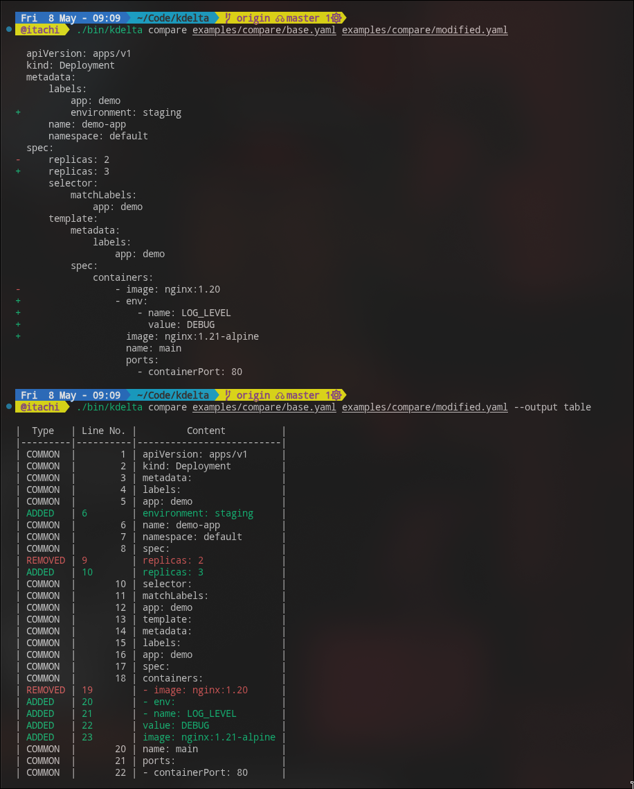
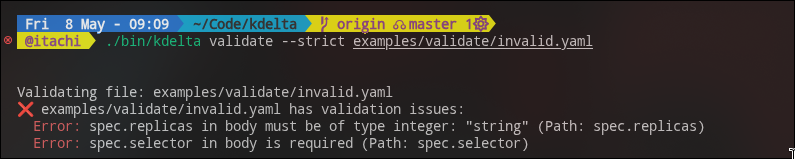
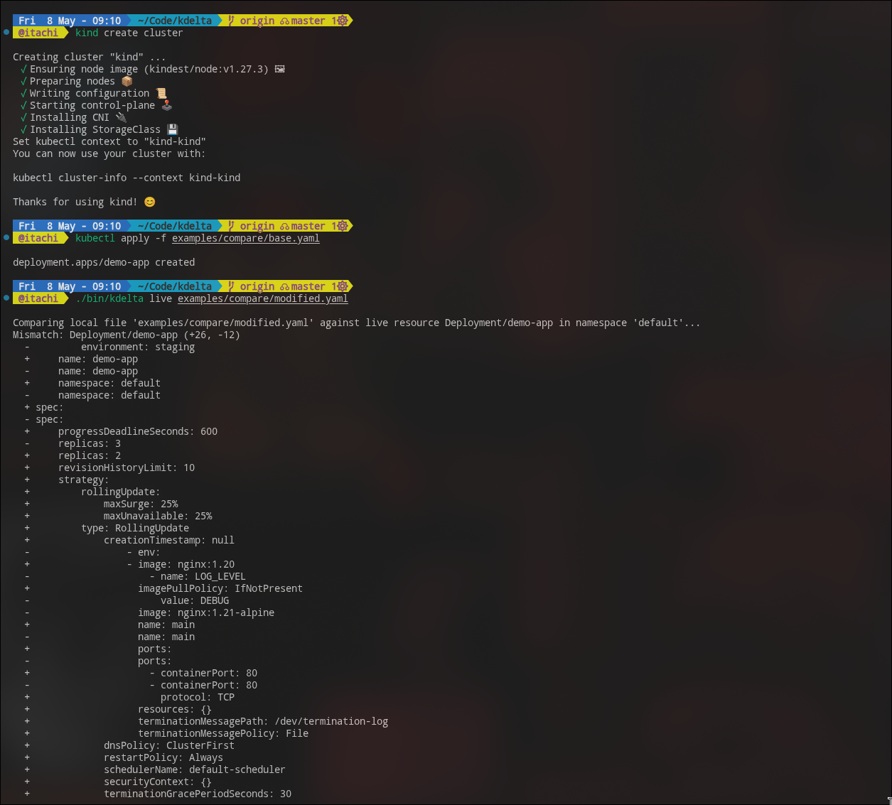

# kdelta: The Kubernetes Configuration Diff & Validation Tool

**kdelta** is a powerful, developer-friendly CLI tool designed to solve the "YAML Hell" in Kubernetes. It simplifies configuration management by providing real-time validation, semantic comparison, and drift detection for your Kubernetes manifests.

---

## ✨ Current Features

- YAML semantic comparison
- Kubernetes schema validation
- Live cluster resource comparison
- Drift detection
- Multi-cluster diffing
- CLI interface with Cobra

---

## 🛑 The Problem: Why kdelta?

Kubernetes configuration management is notoriously difficult. As your infrastructure grows, you inevitably face "YAML Hell":

*   **Configuration Drift**: The silent killer of stability. A developer tweaks a deployment in staging, forgets to commit it, and suddenly production behaves differently. Standard tools don't track this well.
*   **YAML Complexity & Blindness**: Kubernetes manifests can be thousands of lines long. Manually diffing them to find a single changed environment variable or label is like finding a needle in a haystack.
*   **"It Works on My Machine"**: Deployments fail because of missing required fields, invalid types, or subtle schema violations that aren't caught until apply time.
*   **Lack of Context**: Standard `diff` tools see text, not objects. They don't know that `replicas: 2` and `replicas: 3` is a scaling event, or that reordering fields in a map doesn't change the actual state.

**kdelta** was built to solve these specific pain points. It's not just a text comparison tool; it's a Kubernetes-aware diff engine.

---

## 🆚 Why kdelta Instead of kubectl diff?

kdelta focuses on semantic Kubernetes-aware comparison instead of raw text diffs. It removes noisy fields, highlights meaningful configuration changes, and supports drift detection across environments and clusters.

---

## 📸 Screenshots

### Architecture
[View the detailed Architecture Diagram](./docs/architecture.md)

### Compare Command


### Validate Command


### Live Cluster Diff


---

## 🚀 The Solution

**kdelta** acts as a specialized lens for your Kubernetes configurations. It bridges the gap between your local code (Desired State) and your running cluster (Live State).

*   **Intelligent Visualization**: See exactly *what* changed in a semantic way. kdelta highlights additions and removals with context, filtering out noise.
*   **Proactive Validation**: Catch errors *before* they hit the cluster. kdelta validates your YAMLs against official Kubernetes schemas, ensuring structural correctness.
*   **Drift Detection**: Automatically scan your infrastructure to find resources that have deviated from your git repository.
*   **Multi-Cluster Awareness**: Easily compare configurations between Staging and Production to ensure parity.

---

## 📖 Usage

For detailed usage instructions and examples, please refer to the [User Guide](docs/usage.md).

### Quick Example

```bash
kdelta compare base.yaml modified.yaml --output table
```
*(See the Compare Command screenshot above for the output!)*


Here is a quick overview of the available commands:

*   `kdelta compare`: Compares two local Kubernetes configuration files.
*   `kdelta validate`: Validates manifests against OpenAPI schemas.
*   `kdelta live`: Compares a local file against a live cluster resource.
*   `kdelta cluster`: Compares resources between two clusters/contexts.
*   `kdelta drift`: Checks for configuration drift across a directory of files.

---

## 🛠️ Installation

### Prerequisites
*   Go 1.24 or higher

### Build from Source
```bash
# Clone the repository
git clone https://github.com/YogPandya12/kdelta.git
cd kdelta

# Build the binary
go build -o bin/kdelta ./cmd/kdelta

# (Optional) Add to your PATH
export PATH=$PATH:$(pwd)/bin
```

---

## 🚧 Project Status

**Current Status**: 🟢 **Active Development**

I have successfully built the core CLI foundation and integrated it with live Kubernetes clusters. The tool is functional for local comparison, live drift detection, and multi-cluster analysis.

I am actively working on **Advanced Diff Intelligence**, which will bring semantic diffing (understanding the *meaning* of changes, not just text) and smarter filtering.

---

## 🛣️ Roadmap

I am building a complete ecosystem for Kubernetes Configuration Management:

*   [x] **Phase 1: Foundation (MVP)** - Core CLI, YAML parsing, basic diffing, validation.
*   [x] **Phase 2: Cluster Integration** - `client-go` integration, live comparison, drift detection, multi-cluster support.
*   [ ] **Phase 3: Advanced Diff Intelligence** - Semantic diffing, ignore rules, smart defaults handling.
*   [ ] **Phase 4: Validation & Security** - Policy integration, security checks.
*   [ ] **Phase 5: Automation & Integration** - CI/CD pipelines, continuous monitoring.
*   [ ] **Phase 6: Advanced Features** - Plugin system, visualization.

---

## 🤝 Contributing

I am building this tool in the open and would love for other developers to join me! Whether it's fixing a bug, adding a new feature, or improving documentation, your contributions are welcome.

1.  Fork the Project
2.  Create your Feature Branch (`git checkout -b feature/AmazingFeature`)
3.  Commit your Changes (`git commit -m 'Add some AmazingFeature'`)
4.  Push to the Branch (`git push origin feature/AmazingFeature`)
5.  Open a Pull Request
