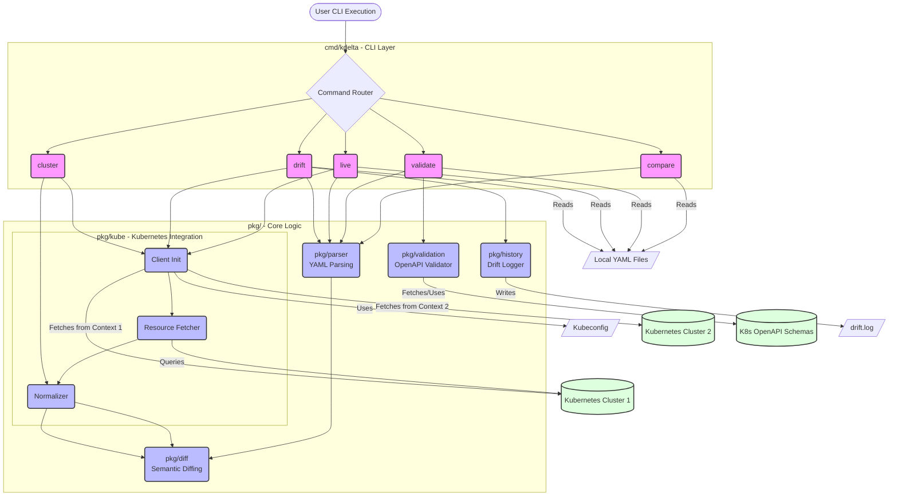

# kdelta Architecture

This document outlines the internal architecture and data flow of the `kdelta` CLI tool.

## System Architecture

The following diagram illustrates the core components of `kdelta` and how they interact based on different user commands.

## Component Breakdown

1.  **`cmd/kdelta`**: Uses Cobra to handle command-line arguments, routing, and formatting the final output (JSON, Table, or colored text).
2.  **`pkg/parser`**: Responsible for reading YAML files and converting them into canonical, unstructured objects that the diffing engine can understand.
3.  **`pkg/diff`**: The core line-by-line comparison engine. It compares canonicalized YAML representations to identify semantic additions, deletions, and modifications.
4.  **`pkg/validation`**: Interfaces with the `go-openapi` libraries to validate parsed YAML files against official Kubernetes OpenAPI definitions.
5.  **`pkg/kube`**: 
    *   Initializes the `client-go` dynamic client.
    *   Fetches live resources from the cluster.
    *   **Normalizer**: Strips out runtime-specific fields (like `status`, `uid`, `creationTimestamp`) before comparison to ensure accurate diffing.
6.  **`pkg/history`**: Handles appending drift events in JSON format to the local audit log (`drift.log`).
